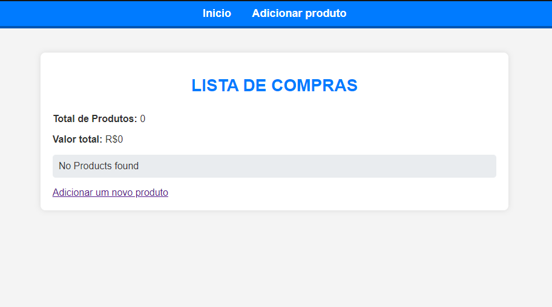
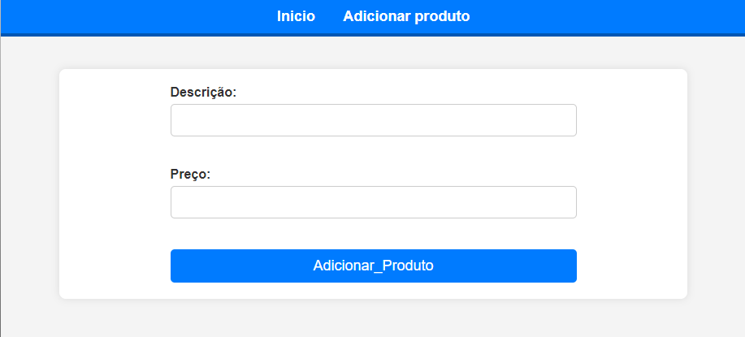
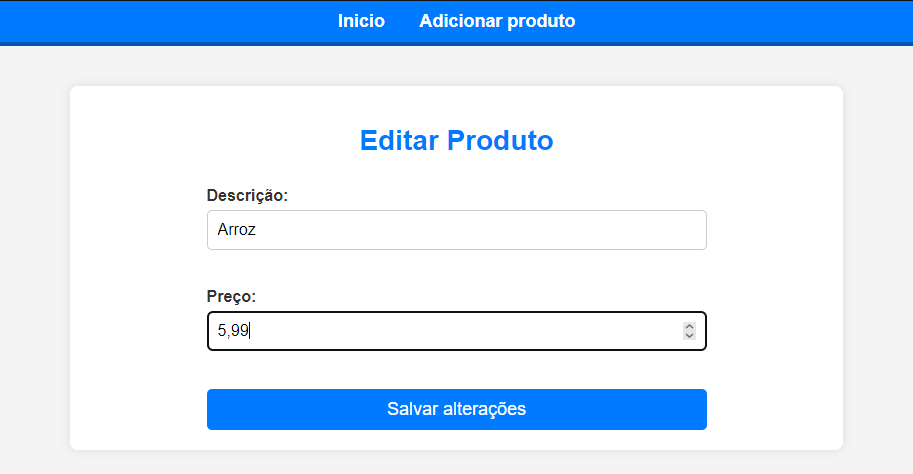
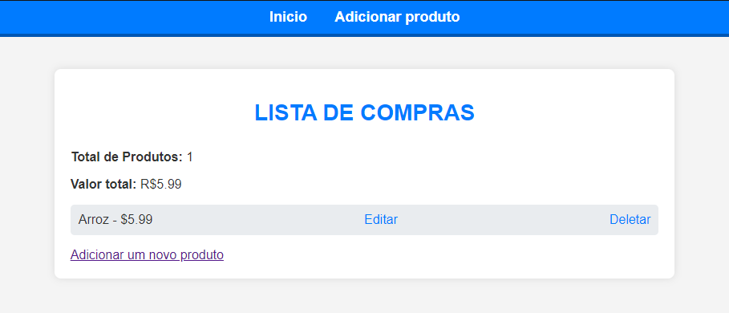

<h1 align="center">Uma simples aplicação de cadastro e listagem de produtos</h1>

  <a href="#-tecnologias">Tecnologias</a>&nbsp;&nbsp;&nbsp;|&nbsp;&nbsp;&nbsp;
  <a href="#-projeto">Projeto</a>&nbsp;&nbsp;&nbsp; | &nbsp;&nbsp;&nbsp;
  <a href="#-principais-bibliotecas">Principais Bibliotecas</a>&nbsp;&nbsp;&nbsp; | &nbsp;&nbsp;&nbsp
  <a href="#-Para-executar-o-projeto">Para executar o projeto</a>

 

  
  
  
  

## 🚀 Tecnologias

Esse projeto foi desenvolvido com as seguintes tecnologias:

- Python
- Flask

## 📚 Principais Bibliotecas

- render_template
- request
- redirect
- url_for

## 💻 Projeto

Desenvolvendo uma aplicação web usando python e sua framework Flask, com finalidade de cadastrar e listar produtos para ter como objetivo obter uma lista de compras por exemplo.

## 👨‍💻 Para executar o projeto

1. Clone o repositório: `git clone https://github.com/davioliveiraes/python-projects/tree/main/cadastro-listagem-produtos-Flask`
2. Abra o terminal e caminhe até a pasta do projeto: `cd cadastro-listagem-produtos-Flask`
2. Em seguida execute no terminal mesmo: `python app.py`
